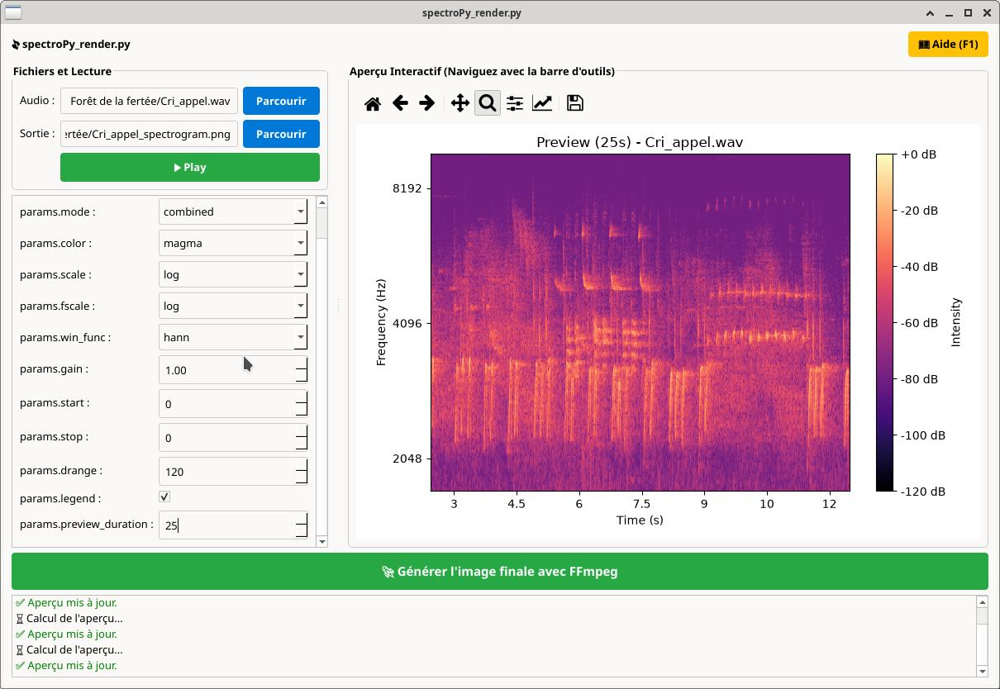
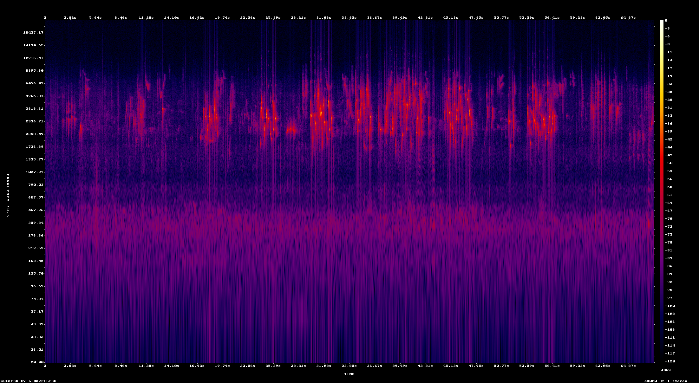

# spectroPy_render

**This tool generates high-resolution spectrograms. It uses FFmpeg (showspectrumpic filter) for the final export and librosa/matplotlib for the interactive preview.**

---

### ✨ Features

- **Interactive Preview**: Real-time spectrogram visualization with adjustable parameters
- **FFmpeg Export**: High-resolution output using `showspectrumpic` filter
- **Multiplatform**: Works on GNU/Linux, Windows, and macOS (look at documentation)
- **Bilingual Interface**: French and English support
- **Audio Playback**: Listen to your recordings directly in the application
- **CLI Automation**: Batch processing capabilities for developers
- **Customizable Parameters**: Size, color palette, frequency scales, window functions, and more ...

---

## 📸 Preview

### Interface Preview

### Spectrogram Example

---

##  Quick Links

- **📚 Library & Resources**: [Visit our Library](https://nid.morgandemus.fr/bibliotheque.html)
- **📖 Documentation (Français)**: [documentation_fr.md](documentation_fr.md)
- **📖 Documentation (English)**: [documentation_en.md](documentation_en.md)

---

## 🚀 Language choice

### Terminal (GNU/Linux)

- **Français** :<code> ./run.sh --lang fr</code>
- **English** :<code> ./run.sh --lang en</code>
